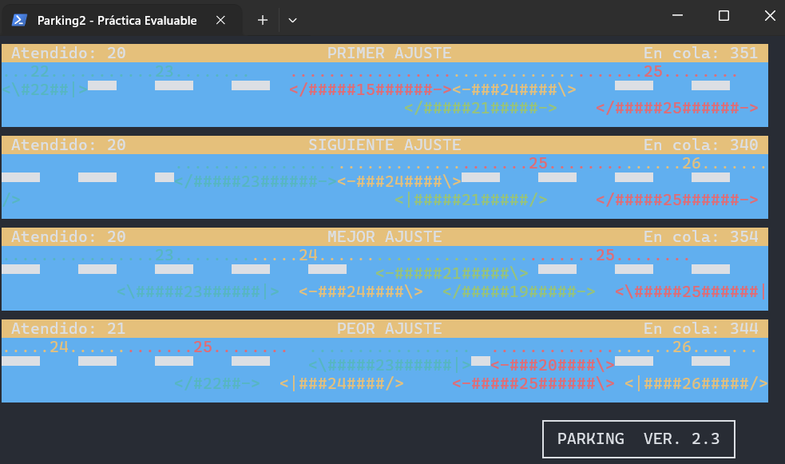

# Parking II — Segunda práctica de Sistemas Operativos II
 

 
Simulación de la gestión de memoria de un sistema operativo con particiones
de tamaño dinámico, mediante el símil de aparcar coches en una acera con
cuatro algoritmos de colocación: **First Fit**, **Next Fit**, **Best Fit** y
**Worst Fit**. Práctica de la asignatura **Sistemas Operativos II**
(Universidad de Salamanca), curso 2023/24.
 
Es la evolución en Windows de la primera práctica de la asignatura (la misma
simulación, pero en Linux con procesos y memoria compartida System V/POSIX):
mismo problema y mismos algoritmos, pero aquí en un único proceso
multihilo (`CreateThread`) que hace llamadas a la API de **WIN32**, y usando
una biblioteca de enlazado dinámico (`parking.dll`, proporcionada por la
asignatura) en lugar de enlazado estático.
 
## Arquitectura
 
- `parking2.exe` carga `parking.dll` en tiempo de ejecución
  (`LoadLibrary` / `GetProcAddress`) y le pasa punteros a las funciones que
  implementan los cuatro algoritmos de llegada y la función de salida.
- El estado se guarda en una zona de memoria compartida
  (`CreateFileMapping` + `MapViewOfFile`), protegida por un mutex con
  nombre, igual que en la práctica de Linux con memoria compartida entre
  procesos.
- Cada coche se gestiona en su propio hilo. Un contador por algoritmo
  (`siguiente_coche_aparcar`) obliga a que los coches aparquen en orden
  numérico consecutivo, y cada hilo espera su turno en un semáforo propio
  con nombre (`SEM_hilo_N`).
- No hay proceso ni buzón de mensajes para avisar del fin: la simulación
  termina al pulsar `Ctrl+C` o automáticamente a los 30 segundos.
## Requisitos
 
- Windows con Visual Studio (proyecto de tipo aplicación de consola, C++).
- `parking.dll`, incluida en este repositorio, debe estar en la misma
  carpeta que `parking2.exe` al ejecutar.
## Compilar y ejecutar
 
1. Abrir `parking2.slnx` con Visual Studio y compilar (`Debug` o `Release`,
   `x64`).
2. Copiar `parking.dll` a la carpeta donde se genere `parking2.exe`
   (por ejemplo `parking2\x64\Debug\`).
3. Ejecutar desde `cmd`:
```bat
parking2.exe <retardo> [D]
```
 
- `<retardo>`: entero ≥ 0, controla la velocidad de la simulación.
- `D` (opcional): activa el modo debug y redirige la salida de errores a
  `debug.log`.
## Estructura del repositorio
 
```
.
├── parking2.slnx        # Solución de Visual Studio
├── parking2/
│   ├── parking2.cpp      # Código fuente
│   ├── parking2.h        # Cabecera del proyecto
│   ├── parking2.vcxproj
│   └── parking2.vcxproj.filters
├── parking.dll            # Biblioteca proporcionada por la asignatura
├── enunciado.pdf           # Enunciado de la práctica
├── captura.png
└── README.md
```
 
Los ficheros de compilación (`Debug/`, `x64/`, `.vs/`, `.obj`, `.pdb`, etc.)
y los ficheros generados en tiempo de ejecución (`debug.log`,
`traza_x_dest.txt`) no se incluyen en el repositorio (ver `.gitignore`).
 
